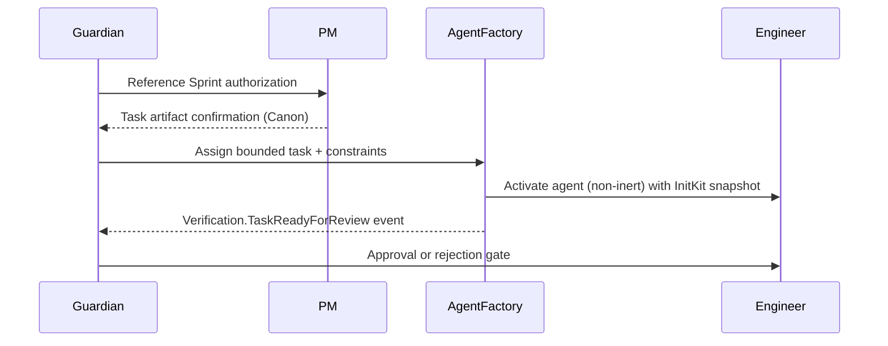

# PlexiMesh Runtime Documentation

Senior engineers and platform architects can use this guide to understand the PlexiMesh Runtime as an operational system. The document is structured for GitHub Pages and includes intra-page navigation.

## Navigation
- [Overview: PlexiMesh Runtime](#overview-pleximesh-runtime)
- [Core Concepts](#core-concepts)
- [Execution Model](#execution-model)
- [Messaging & Events](#messaging--events)
- [Agent Runner & Harness](#agent-runner--harness)
- [Runtime Components](#runtime-components)
- [Governance & Safety](#governance--safety)
- [Observability (AWACS – Conceptual)](#observability-awacs--conceptual)
- [Design Philosophy](#design-philosophy)

---

## Overview: PlexiMesh Runtime

### What the Runtime Is
PlexiMesh Runtime is a governed execution substrate that hosts role-specific agents (Guardian, PM, Engineering, Librarian, Voodoo) and enforces constitutional rules such as role immutability, event-signed interactions, and append-only decision trails. It provides the plumbing that lets autonomous agents operate while remaining verifiably safe.

### Problems It Solves
- Enforces Guardian-controlled lifecycle gates for every coding activity.
- Guarantees deterministic replay through signed envelopes, append-only logs, and InitKit references.
- Provides a consistent host for agents so capabilities, permissions, and lifecycle transitions are explicitly audited.

### What It Is Not
- **Not** a generic workflow engine: it never infers tasks or approvals.
- **Not** an autonomous planner: PM and Guardian artifacts must exist before execution.
- **Not** a code generation sandbox: Engineering Agents can only act within Guardian-issued tasks.

### Differentiation from Traditional Workflow Engines
Traditional workflow engines orchestrate human or machine tasks implicitly once configured. PlexiMesh insists every action travels through constitutional law: Guardian/Librarian-managed Canon, signed events, and immutable roles. Execution is explicit and accountable; no background automations alter state without Guardian knowledge.

---

## Core Concepts

### Agents
Agents are role-specific processes instantiated by the Agent Factory. Each agent loads InitKit guidance, declares its capabilities, and operates only through the runtime interfaces provided at startup.

### Roles
- **Guardian:** Authorizes sprints, tasks, and commits; enforces laws; records decision logs.
- **PM:** Decomposes intent into bounded tasks and planning artifacts.
- **Engineering:** Implements Guardian-issued tasks with zero planning authority.
- **Librarian:** Maintains Canon, ensuring documentation and laws remain authoritative.
- **Voodoo:** Handles out-of-band debugging/recovery under Guardian supervision (kept inert unless explicitly activated).

Role immutability is enforced structurally: an agent receives one role identifier at instantiation and it cannot change.

### Inert vs Non-Inert Execution
- **Inert agents** have no active tasks; they are instantiated but waiting for orders.  
- **Non-inert agents** hold an active assignment authorized by Guardian and documented in Canon artifacts. Transitions between inert and non-inert states are logged events.

### Canon vs Decision Logs vs Events
- **Canon:** Librarian-managed documents (laws, tasks, diagrams). Agents treat Canon as read-only truth.
- **Decision Logs:** Guardian journal entries that explain why a gate opened or closed.
- **Events:** Runtime facts (envelopes) that record what happened. They are immutable and can be replayed for audits.

---

## Execution Model

### Authorization, Assignment, Execution
1. **Authorization:** Guardian validates Canon readiness and emits lifecycle events (e.g., `Lifecycle.ExecutionArmed`).
2. **Assignment:** Guardian issues a bounded task referencing Canon artifacts; Agent Factory loads the Engineering Agent with those constraints.
3. **Execution:** The Engineering Agent performs edits, emits telemetry, and proposes code changes via `Verification.TaskReadyForReview` for Guardian review.

### Execution Handshake

### No Implicit Execution
Every state transition (arming, assignment, review, commit) requires a logged event plus, when applicable, a Canon artifact. Agents have no permission to act outside explicit Guardian commands.

### Correlation IDs & Lifecycle Boundaries
Guardian mints a correlation ID at sprint arming. All events, decision logs, and commits referencing that work must carry the same root ID (with optional span identifiers). Lifecycle boundaries (init, start, task issued, proposal, approval, shutdown) are enforced through the harness and recorded events, ensuring deterministic reconstruction.

---

## Messaging & Events

### Event-First Architecture
The runtime communicates entirely through signed event envelopes. Even when direct calls occur (e.g., Guardian instructing Agent Factory), the authoritative record is the emitted event.

### Required Event Types
- **Lifecycle:** Execution armed, agent instantiated, sprint slice completed.
- **Tasking:** Task issued, task in-progress, revision required.
- **Verification:** Task ready for review, execution approved/rejected.
- **Repository:** Commit published after Guardian approval.

### Ordering Guarantees
Events enter an append-only log with sequence identifiers. The runtime enforces causal ordering for blocking interactions: an approval cannot be recorded before the corresponding `Verification.TaskReadyForReview` event exists. Non-blocking telemetry may interleave but retains timestamps and sequence numbers.

### Correlation & Traceability
Each envelope includes `correlation_id`, optional `span_id`, runtime version, InitKit hash, and agent identifiers. This metadata allows AWACS and auditors to rebuild exact timelines across Guardian decisions, agent actions, and repository commits.

### Events Are Facts, Not Commands
Commands flow through Guardian-to-Agent dialogues. Events merely state what occurred (“Verification.TaskReadyForReview”). Downstream components must not treat events as instructions; they are immutable truths used for audits, observability, and replay.

---

## Agent Runner & Harness

### What the Agent Runner Is
The Agent Runner is the execution host that wraps agents with lifecycle management, InitKit loading, signature verification, and event publishing interfaces.

### Why It Exists
- Ensures every agent begins with the same constitutional context.
- Provides deterministic lifecycle transitions (`Init → Start → HandleEvent → Shutdown`).
- Captures observability by recording every inbound/outbound envelope.

### Responsibilities
- Load capability manifest and enforce declared permissions.
- Inject Guardian-provided dependencies (publisher, subscriber, storage handles).
- Terminate agents that violate lifecycle or emit invalid events.

### Non-Responsibilities
- Does not invent tasks or mutate Canon.
- Does not approve work; that authority remains with Guardian.
- Does not provide business logic; agents themselves implement their role-specific handlers.

### Separation from Agents
By keeping runners independent, the runtime can update lifecycle enforcement or observability logic without rewriting agent code. Agents focus on their single responsibility; runners focus on governance plumbing.

---

## Runtime Components

| Component | Purpose |
|-----------|---------|
| **Runtime Core** | Go-based service that wires InitKit, message bus, EMS signatures, and event store. |
| **Agent Factory** | Instantiates agents with manifests, maintains inert pools, and transitions agents to active state upon Guardian assignment. |
| **Event Sink** | Append-only store plus EMS verifier ensuring every envelope is authenticated and replayable. |
| **Canon (Librarian-managed)** | Versioned documentation, laws, and task artifacts stored outside runtime repos but mounted read-only when needed. |
| **Decision Logs (Guardian-managed)** | Human-readable justifications for each gate; referenced when agents or humans audit state transitions. |

Components interact strictly through event contracts and Guardian approvals. For example, the Agent Factory cannot activate an agent without a corresponding Guardian event referencing a Canon task ID.

---

## Governance & Safety

### Guardian Laws (High-Level)
- Automation default paired with human gates for critical transitions.
- Canon adherence before execution.
- Verified event signatures and append-only logs.

### Role Immutability
Each agent receives a role at instantiation. The Agent Factory enforces assignment; Guardian double-checks before approving work. Attempts to mutate role identity trigger an immediate halt and human escalation.

### Deterministic Continuation
Because lifecycle events, InitKit hashes, and correlation IDs are recorded, any execution can be replayed or resumed without ambiguous state. Determinism is a core safety property and is enforced structurally (via harness and logs) rather than through ad-hoc procedures.

### Structural Enforcement
Safety does not rely on manual checklists. Agents simply cannot obtain capabilities unless Guardian and the runtime grant them, and all outputs are validated through EMS signatures. Violations become first-class events, stopping execution until humans intervene.

---

## Observability (AWACS – Conceptual)

### What AWACS Is
AWACS is the read-only observability system envisioned for PlexiMesh. It consumes events, decision logs, and Canon references to render execution timelines.

### Why It Is Read-Only
Observability must never become an attack vector. AWACS cannot mutate runtime state; it mirrors facts for humans or secondary systems.

### What It Observes
- Event streams (lifecycle, tasking, verification, repository).
- Correlation chains tying Guardian decisions to agent actions.
- Canon references used in each execution slice.

### Forbidden Actions
- Cannot inject commands or modify Canon.
- Cannot re-order events or suppress telemetry.
- Cannot approve or reject work. All authority remains with Guardian.

---

## Design Philosophy

### Don’t Solve Problems You Don’t Have
The runtime ships the minimal scaffolding required for lawful execution: message bus, EMS signatures, harness, and Canon integration. Features such as UI dashboards or generalized workflow builders remain out of scope until governance demands them.

### Separation of Authority, Orchestration, Execution, Observation
- **Authority:** Guardian and Canon define what may occur.
- **Orchestration:** Agent Factory and PM convert intent into runnable tasks.
- **Execution:** Engineering agents implement changes under harness supervision.
- **Observation:** AWACS and append-only logs provide visibility without power.

### Humans Stay at Intent Boundaries
Humans author the constitutional documents, approve sprints, and intervene on ambiguity. Agents execute the mechanical work. This separation keeps accountability clear and prevents silent drift in architectural direction.

---

For sprint-specific flows, see [Sprint 1 Execution Model](sprint-1-execution-model.md). For canonical tasks, consult the `canon/tasks/` directory maintained by the Librarian.
