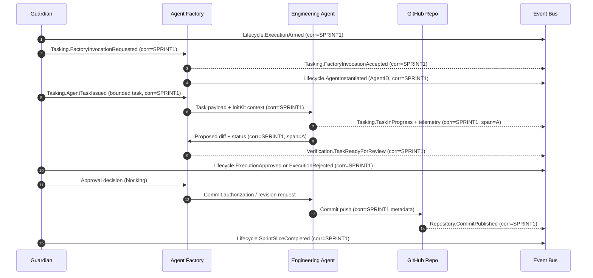

> This document is published for readability. The authoritative version is stored in the Canon (`Sprint-1-Execution-Model.md`).

# Sprint 1 Execution Model: Guardian-Governed Agent Code Production

This Canon document records the authorized flow that carries PlexiMesh from an approved Sprint 1 artifact to the first engineering commit. It freezes the intended operating model before execution begins so humans, agents, and future visualization systems share the same frame of reference.

## Execution Narrative

1. **Guardian arms Sprint execution gates.**  
   - Guardian SHALL verify that the Sprint 1 intent artifact is Canonical and unaltered.  
   - Guardian MUST record the arming decision in the lifecycle log and emit a Lifecycle `ExecutionArmed` event carrying the Sprint ID, version hashes, and a new correlation ID that will follow every downstream action.  
   - No downstream actor MAY publish code or tasks until this gate is logged.

2. **Guardian authorizes Agent Factory invocation.**  
   - Once execution is armed, Guardian SHALL issue a bounded directive to the Agent Factory specifying the target slice (Engineer), the allowed capability manifest, and the constraints for the first coding task.  
   - Guardian MUST emit a Tasking `FactoryInvocationRequested` event that references the same correlation ID so observability tools can stitch the decision to the arming log.  
   - Agent Factory MUST acknowledge with `FactoryInvocationAccepted` (blocking); if the acknowledgment is missing or invalid, Guardian SHALL halt execution and raise a Violation event.

3. **Agent Factory instantiates an idle Engineering Agent.**  
   - Agent Factory SHALL resolve the requested capability manifest, hydrate InitKit context, and spin up an idle Engineering Agent instance without granting task authority.  
   - The Factory MUST emit a Lifecycle `AgentInstantiated` event and annotate it with the runtime version, AgentID, and inherited correlation ID.  
   - No code execution occurs at this stage; the agent sits armed but idle.

4. **Guardian issues the first bounded coding task.**  
   - Guardian MUST translate the Sprint intent into a single bounded task that references tracked files, acceptance criteria, and guardrails.  
   - Guardian SHALL deliver the task to the Agent Factory, which relays it to the Engineering Agent via the runtime message bus.  
   - Guardian MUST log a Tasking `AgentTaskIssued` event before the payload is delivered; the Engineering Agent SHALL NOT begin work until this event is stored.

5. **Engineering Agent attempts execution.**  
   - The Agent SHALL operate strictly within the task envelope: load InitKit, edit only authorized files, and record its own observability events (e.g., `TaskInProgress`, `TaskBlocked`).  
   - Each outbound envelope MUST include the inherited correlation ID plus a task-scoped span identifier so downstream tooling can thread every edit and observation back to the originating Sprint authorization.  
   - If the agent needs clarification, it SHALL emit a Tasking `ClarificationRequested` event rather than deviating from scope.

6. **Guardian approval gate for commit.**  
   - Upon completion, the Agent Factory packages the diff and emits a Verification `TaskReadyForReview` event addressed to Guardian.  
   - Guardian MUST inspect the diff, InitKit references, and event log. Approval SHALL be recorded via a Lifecycle `ExecutionApproved` event; rejection SHALL be recorded via `ExecutionRejected`, each referencing the same correlation chain.  
   - Guardian MUST block Git operations until the approval decision is logged; no commit SHALL be pushed without an explicit approval event.

7. **Commit success or rejection.**  
   - If approved, the Engineering Agent (via the Factory) SHALL perform the bounded commit, sign it with the recorded correlation ID in the commit message metadata, and emit a Repository `CommitPublished` event noting the repo, branch, and diff hash.  
   - If rejected, Guardian MUST return a revision task that references the rejection reason and emits a Tasking `RevisionRequired` event; the Agent SHALL restart from Step 5 with the same correlation root but a new span identifier.

8. **Sprint-level completion signaling.**  
   - After the commit lands (or the revision loop completes), Guardian SHALL evaluate whether the Sprint 1 execution slice is satisfied.  
   - Guardian MUST emit a Lifecycle `SprintSliceCompleted` event containing the sprint identifiers, code artifact references, and terminal status.  
   - Only after this event MAY downstream systems (QA harnesses, AWACS visualizers) treat Sprint 1 execution as closed.

## Sequence Diagram

*Solid arrows denote blocking interactions; dashed arrows (Bus callbacks) denote asynchronous event emissions. Every envelope carries the same root correlation ID (`SPRINT1` placeholder) plus per-span identifiers injected by the Engineering Agent.*

## Messaging & Events

### Event Envelope
- **Domain / Type:** MUST follow the canonical table in `pkg/event/metadata.go`. Lifecycle, Tasking, Verification, and Repository domains are exercised in this flow.  
- **Source / Target:** Guardian is the authoritative source for lifecycle gates; Agent Factory sources instantiation events; Engineering Agent sources execution telemetry; GitHub Repo (via runtime bridge) sources repository events. Targets are optional unless a blocking response is expected.  
- **Correlation:** Guardian MUST mint a root correlation ID when arming execution. All participants SHALL copy this ID verbatim into every downstream envelope and MAY append span IDs (`corr:SPRINT1/span:A`) for sub-steps.  
- **Context:** Runtime version, InitKit hash, Sprint identifiers, task IDs, and AgentIDs MUST be included to guarantee replayability.  
- **Signature:** EMS signatures SHALL wrap the entire envelope so Guardian can reject tampered events before routing.

### Required Events by Step
- **ExecutionArmed (Lifecycle):** Authoritative; blocks all later steps. Stored before any factory invocation.  
- **FactoryInvocationRequested / Accepted (Tasking):** Blocking pair; absence or mismatch MUST halt execution.  
- **AgentInstantiated (Lifecycle):** Informational but required for traceability of which AgentID handled the task.  
- **AgentTaskIssued (Tasking):** Authoritative; Engineering Agent MUST confirm receipt before work begins.  
- **TaskInProgress / ClarificationRequested (Tasking/Telemetry):** Informational; keeps Guardian observability and AWACS pipelines fed.  
- **TaskReadyForReview (Verification):** Blocking; Guardian SHALL NOT approve without it.  
- **ExecutionApproved / ExecutionRejected (Lifecycle):** Authoritative gate for repository access.  
- **CommitPublished (Repository):** Authoritative record tying Git commit hash to the correlation chain.  
- **SprintSliceCompleted (Lifecycle):** Final authoritative signal that closes the Sprint 1 execution slice.  
- **Violation events (any domain):** MUST be emitted if an expected event or acknowledgment fails; they are authoritative blockers.

### Traceability for AWACS
- Every event MUST include `event_id`, `parent_event_id`, and `correlation_id`. Guardian’s arming event acts as the root; acknowledgments (e.g., Factory acceptance) reference the root as `parent_event_id`.  
- Blocking steps MUST wait for their paired acknowledgment event IDs before proceeding, enabling deterministic reconstruction.  
- Informational events (e.g., telemetry) MAY stream freely but still include the root correlation ID so AWACS or downstream dashboards can render the timeline as a single lane.  
- Git commit metadata SHALL embed the correlation ID (e.g., `corr:SPRINT1`) so external systems can map repository history back to the event mesh without querying runtime logs.

---

This document MUST be updated only when Guardian-authorized changes alter the Sprint 1 execution pathway, event contracts, or gating semantics.
