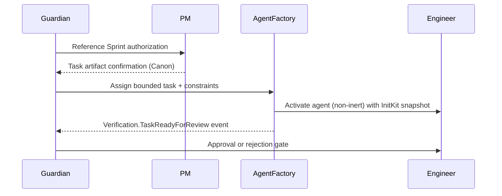

# PlexiMesh Runtime 文件

**Language:** 繁體中文 (zh-Hant)
**Applies to:** current (pre-versioned)

資深工程師與平台架構師可使用本指南理解 PlexiMesh Runtime 作為營運系統的運作方式。本文件以 GitHub Pages 呈現並提供頁內導覽。

## 導覽
- [PlexiMesh Runtime 概覽](#overview-pleximesh-runtime)
- [核心概念](#core-concepts)
- [執行模型](#execution-model)
- [訊息與事件](#messaging--events)
- [Agent Runner 與 Harness](#agent-runner--harness)
- [Runtime 組件](#runtime-components)
- [治理與安全](#governance--safety)
- [可觀測性（AWACS – 概念）](#observability-awacs--conceptual)
- [設計理念](#design-philosophy)

---

## PlexiMesh Runtime 概覽 {#overview-pleximesh-runtime}

### Runtime 是什麼
PlexiMesh Runtime 是一個具治理的執行基座，承載角色特定的代理（Guardian、PM、Engineering、Librarian、Voodoo），並強制憲制規則，例如角色不可變、事件簽章互動與附加式決策軌跡。它提供讓自主代理在可驗證安全下運作的基礎管線。

### 解決的問題
- 對每項程式碼活動強制 Guardian 控制的生命週期 gate。
- 透過簽章封裝、附加式日誌與 InitKit 參照確保可重播的確定性。
- 提供一致的代理宿主，讓能力、權限與生命週期轉換可被明確稽核。

### 它不是什麼
- **不是** 通用工作流程引擎：不會推斷任務或核准。
- **不是** 自主規劃器：執行前必須有 PM 與 Guardian 產物。
- **不是** 程式碼生成沙盒：Engineering Agent 只能在 Guardian 指派的任務內行動。

### 與傳統工作流程引擎的差異
傳統工作流程引擎會在設定後隱式協調人類或機器任務。PlexiMesh 要求每個行動都經過憲制法：由 Guardian/Librarian 管理的 Canon、簽章事件與不可變角色。執行是明確且可問責的；不允許背景自動化在 Guardian 不知情下改變狀態。

---

## 核心概念 {#core-concepts}

### 代理（Agents）
代理是由 Agent Factory 實例化的角色特定程序。每個代理載入 InitKit 指引，宣告能力，並且只能透過啟動時提供的 runtime 介面運作。

### 角色（Roles）
- **Guardian:** 核准 sprint、任務與提交；強制法律；記錄決策日誌。
- **PM:** 將意圖拆解為有界任務與規劃產物。
- **Engineering:** 在無規劃權限下執行 Guardian 指派任務。
- **Librarian:** 維護 Canon，確保文件與法律具權威性。
- **Voodoo:** 在 Guardian 監督下處理脫鉤除錯/復原（除非明確啟動，否則保持惰性）。

角色不可變是結構性強制的：代理在實例化時得到一個角色識別，之後不可變更。

### 惰性與非惰性執行
- **惰性代理** 沒有主動任務；已實例化但等待指令。  
- **非惰性代理** 持有由 Guardian 授權且記錄於 Canon 的任務。惰性與非惰性狀態轉換必須以事件記錄。

### Canon、決策日誌與事件
- **Canon:** 由 Librarian 管理的文件（法律、任務、圖表）。代理必須視 Canon 為唯讀真相。
- **決策日誌:** Guardian 為每個 gate 的開啟或關閉提供理由的紀錄。
- **事件:** Runtime 事實（封裝），記錄實際發生的事。事件不可變，並可用於稽核與重播。

---

## 執行模型 {#execution-model}

### 授權、指派、執行
1. **授權：** Guardian 確認 Canon 就緒並發出生命週期事件（例如 `Lifecycle.ExecutionArmed`）。
2. **指派：** Guardian 發出引用 Canon 產物的有界任務；Agent Factory 載入 Engineering Agent 並套用限制。
3. **執行：** Engineering Agent 進行修改、發送遙測，並透過 `Verification.TaskReadyForReview` 提出給 Guardian 審查。

### 執行握手

### 無隱式執行
每個狀態轉換（arming、assignment、review、commit）都需要記錄事件，並在適用時引用 Canon 產物。代理不允許在 Guardian 明確指令之外行動。

### Correlation ID 與生命週期邊界
Guardian 在 sprint arming 時產生 correlation ID。所有相關事件、決策日誌與提交都必須包含相同的 root ID（可附加 span identifiers）。生命週期邊界（init、start、task issued、proposal、approval、shutdown）由 harness 強制並記錄事件，確保可重建的確定性。

---

## 訊息與事件 {#messaging--events}

### 事件優先架構
Runtime 完全以簽章事件封裝溝通。即使有直接呼叫（例如 Guardian 指示 Agent Factory），權威記錄仍是事件。

### 必要事件類型
- **Lifecycle:** Execution armed、agent instantiated、sprint slice completed。
- **Tasking:** Task issued、task in-progress、revision required。
- **Verification:** Task ready for review、execution approved/rejected。
- **Repository:** Commit published after Guardian approval。

### 序列保證
事件以附加式日誌與序列識別進入系統。Runtime 對阻塞互動強制因果順序：核准不得早於對應的 `Verification.TaskReadyForReview` 事件。非阻塞遙測可穿插，但仍保留時間戳與序列號。

### 關聯與可追溯性
每個封裝包含 `correlation_id`、可選 `span_id`、runtime version、InitKit hash 與代理識別。這些中繼資料讓 AWACS 與稽核者能重建 Guardian 決策、代理行為與提交之間的時間線。

### 事件是事實，不是指令
指令透過 Guardian-to-Agent 的對話流動。事件只陳述發生的事（例如 “Verification.TaskReadyForReview”）。下游組件不得把事件當作指令；事件是不可變事實，用於稽核、可觀測性與重播。

---

## Agent Runner 與 Harness {#agent-runner--harness}

### Agent Runner 是什麼
Agent Runner 是執行宿主，包裹代理的生命週期管理、InitKit 載入、簽章驗證與事件發布介面。

### 為什麼需要它
- 確保每個代理在相同的憲制上下文中啟動。
- 提供可預測的生命週期轉換（`Init → Start → HandleEvent → Shutdown`）。
- 透過記錄每個出入站封裝提供可觀測性。

### 責任
- 載入能力清單並強制宣告的權限。
- 注入 Guardian 提供的依賴（publisher、subscriber、storage handles）。
- 終止違反生命週期或發送無效事件的代理。

### 非責任
- 不創建任務或修改 Canon。
- 不核准成果；權限仍在 Guardian。
- 不提供業務邏輯；代理自行實作角色特定處理。

### 與代理分離
保持 Runner 獨立使 Runtime 能更新生命週期強制與可觀測性邏輯，而不需改寫代理程式。代理專注單一責任；Runner 專注治理管線。

---

## Runtime 組件 {#runtime-components}

| 組件 | 目的 |
|-----------|---------|
| **Runtime Core** | 以 Go 實作，連接 InitKit、message bus、EMS signatures 與 event store。 |
| **Agent Factory** | 以 manifests 實例化代理，維持惰性池，並在 Guardian 指派後切換為 active。 |
| **Event Sink** | 附加式存儲加上 EMS 驗證，確保每個封裝可驗證與可重播。 |
| **Canon (Librarian-managed)** | 版本化文件、法律、任務產物；存於 runtime repo 外但必要時以唯讀掛載。 |
| **Decision Logs (Guardian-managed)** | 針對每個 gate 的人類可讀理由；用於稽核與回溯。 |

組件嚴格透過事件合約與 Guardian 核准互動。例如，Agent Factory 在沒有 Guardian 事件與 Canon 任務 ID 參照之前，不得啟動代理。

---

## 治理與安全 {#governance--safety}

### Guardian 法律（高層）
- 關鍵轉換採自動化預設並配對人類 gate。
- 執行前必須遵循 Canon。
- 必須驗證事件簽章並使用附加式日誌。

### 角色不可變
每個代理在實例化時取得角色。Agent Factory 負責強制，Guardian 在核准前再次檢查。嘗試變更角色會觸發立即中止與人類升級。

### 確定性延續
因為生命週期事件、InitKit hash 與 correlation ID 被記錄，任何執行都能被重播或續行而不產生模糊狀態。確定性是核心安全性，透過 harness 與日誌的結構性保證，而非臨時程序。

### 結構性強制
安全不依賴手動檢查清單。代理無法在 Guardian 與 Runtime 未授權的情況下取得能力，且所有輸出均由 EMS signatures 驗證。違規會成為第一級事件並中止執行，直到人類介入。

---

## 可觀測性（AWACS – 概念） {#observability-awacs--conceptual}

### AWACS 是什麼
AWACS 是 PlexiMesh 規劃中的唯讀可觀測性系統，消費事件、決策日誌與 Canon 參照以呈現執行時間線。

### 為什麼必須唯讀
可觀測性不能成為攻擊向量。AWACS 不得改變 runtime 狀態；它只映射事實給人類或次級系統。

### 觀測內容
- 事件流（lifecycle、tasking、verification、repository）。
- 將 Guardian 決策與代理行為串接的 correlation chain。
- 每個執行切片引用的 Canon 參照。

### 禁止行為
- 不得注入指令或修改 Canon。
- 不得重新排序事件或抑制遙測。
- 不得核准或拒絕成果；權限只在 Guardian。

---

## 設計理念 {#design-philosophy}

### 不解決沒有的問題
Runtime 只提供合法執行所需的最小基礎：message bus、EMS signatures、harness 與 Canon 整合。UI 儀表板或泛用工作流程建構器仍超出範圍，直到治理需求成立。

### 權威、協調、執行、觀測分離
- **權威：** Guardian 與 Canon 定義可發生之事。
- **協調：** Agent Factory 與 PM 把意圖轉成可執行任務。
- **執行：** Engineering agents 在 harness 監督下完成變更。
- **觀測：** AWACS 與附加式日誌提供可見度但沒有權力。

### 人類維持意圖邊界
人類撰寫憲制文件、核准 sprint，並在模糊時介入。代理執行機械性工作。此分離讓責任清楚並避免架構方向被靜默偏移。

---

如需 sprint-specific flows，請參考 [Sprint 1 執行模型](sprint-1-execution-model.md)。如需 Canon 任務，請查閱由 Librarian 維護的 `canon/tasks/` 目錄。

Translation status: Complete
