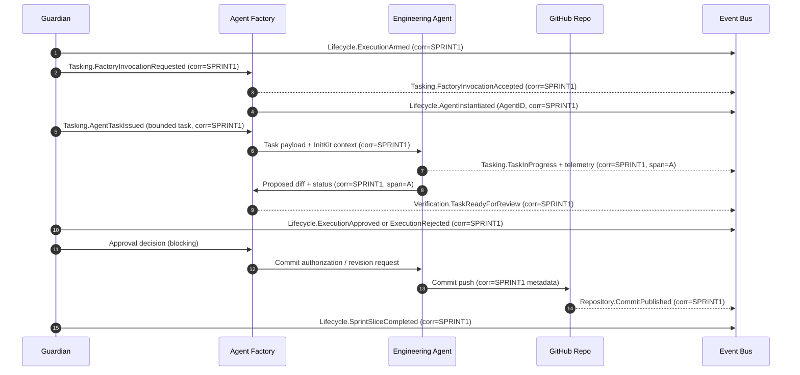

# Sprint 1 執行模型：Guardian 治理下的代理程式碼產出

**Language:** 繁體中文 (zh-Hant)
**Applies to:** current (pre-versioned)

這份 Canon 文件記錄從 Sprint 1 產物核准到首次工程提交的授權流程。它在執行開始前凍結預期作業模型，讓人類、代理與未來視覺化系統共享同一參照。

## 執行敘事

1. **Guardian 啟動 Sprint 執行 gate。**  
   - Guardian SHALL 驗證 Sprint 1 意圖產物為 Canon 且未被修改。  
   - Guardian MUST 記錄 arming 決策於生命週期日誌並發出 Lifecycle `ExecutionArmed` 事件，包含 Sprint ID、版本雜湊與新的 correlation ID，供所有下游行動使用。  
   - 在此 gate 記錄前，任何下游角色不得發佈程式碼或任務。

2. **Guardian 授權 Agent Factory 呼叫。**  
   - 一旦執行已 armed，Guardian SHALL 向 Agent Factory 發出有界指令，指定目標切片（Engineer）、允許的能力清單與第一個程式碼任務的限制。  
   - Guardian MUST 發出 Tasking `FactoryInvocationRequested` 事件並引用相同的 correlation ID，以利可觀測工具串接 arming 日誌。  
   - Agent Factory MUST 以 `FactoryInvocationAccepted` 回應（blocking）；若缺失或無效，Guardian SHALL 停止執行並發出 Violation 事件。

3. **Agent Factory 實例化惰性 Engineering Agent。**  
   - Agent Factory SHALL 解析能力清單、載入 InitKit 上下文，並啟動惰性 Engineering Agent，尚不授予任務權限。  
   - Factory MUST 發出 Lifecycle `AgentInstantiated` 事件，並標註 runtime version、AgentID 與繼承的 correlation ID。  
   - 此階段不執行程式碼；代理保持 armed 但惰性。

4. **Guardian 發出第一個有界程式碼任務。**  
   - Guardian MUST 將 Sprint 意圖轉成單一有界任務，引用受追蹤檔案、驗收標準與護欄。  
   - Guardian SHALL 將任務交付給 Agent Factory，再透過 runtime message bus 轉交給 Engineering Agent。  
   - Guardian MUST 在載荷送達前記錄 Tasking `AgentTaskIssued` 事件；Engineering Agent SHALL 在該事件存檔前不得開始工作。

5. **Engineering Agent 嘗試執行。**  
   - Agent SHALL 嚴格遵循任務範圍：載入 InitKit、只編輯授權檔案，並記錄自身可觀測事件（如 `TaskInProgress`、`TaskBlocked`）。  
   - 每個出站封裝 MUST 含有繼承的 correlation ID 並附加任務範圍的 span identifier，以便下游工具把每次修改與觀測串回原始 Sprint 授權。  
   - 若需要澄清，Agent SHALL 發出 Tasking `ClarificationRequested` 事件，而非偏離範圍。

6. **提交的 Guardian 核准 gate。**  
   - 完成後，Agent Factory 封裝 diff 並發出 Verification `TaskReadyForReview` 事件給 Guardian。  
   - Guardian MUST 檢查 diff、InitKit 參照與事件日誌。核准 SHALL 以 Lifecycle `ExecutionApproved` 記錄；拒絕 SHALL 以 `ExecutionRejected` 記錄，且均引用相同的 correlation chain。  
   - Guardian MUST 在核准決策記錄前阻擋 Git 操作；沒有明確核准事件不得推送 commit。

7. **提交成功或退回。**  
   - 若核准，Engineering Agent（經由 Factory） SHALL 執行有界提交，在 commit 訊息中以 recorded correlation ID 簽署，並發出 Repository `CommitPublished` 事件，記錄 repo、branch 與 diff hash。  
   - 若拒絕，Guardian MUST 發回修訂任務並發出 Tasking `RevisionRequired` 事件；Agent SHALL 使用相同 correlation root 但新的 span identifier 從步驟 5 重新開始。

8. **Sprint 層級完成訊號。**  
   - 在提交落地（或修訂迴圈完成）後，Guardian SHALL 評估 Sprint 1 執行切片是否滿足。  
   - Guardian MUST 發出 Lifecycle `SprintSliceCompleted` 事件，包含 sprint 識別、程式碼產物參照與終態。  
   - 只有在該事件之後，下游系統（QA harness、AWACS 視覺化）才可視 Sprint 1 執行為關閉。

## 序列圖

*實線代表阻塞式互動；虛線（Bus 回呼）代表非同步事件發佈。每個封裝攜帶相同的 root correlation ID（`SPRINT1` 佔位符），並由 Engineering Agent 加入每個 span 的識別。*

## 訊息與事件

### 事件封裝
- **Domain / Type:** MUST 依 `pkg/event/metadata.go` 的 canonical table。此流程涵蓋 Lifecycle、Tasking、Verification、Repository domains。  
- **Source / Target:** Guardian 是 lifecycle gates 的權威來源；Agent Factory 來源為 instantiation events；Engineering Agent 來源為 execution telemetry；GitHub Repo（經 runtime bridge）來源為 repository events。除非需要阻塞回應，target 可省略。  
- **Correlation:** Guardian MUST 在 arming 時建立 root correlation ID。所有參與者 SHALL 原樣複製該 ID，並 MAY 附加 span IDs（`corr:SPRINT1/span:A`）作為子步驟。  
- **Context:** Runtime version、InitKit hash、Sprint identifiers、task IDs 與 AgentIDs MUST 納入，以確保可重播性。  
- **Signature:** EMS signatures SHALL 包裹整個封裝，使 Guardian 可在路由前拒絕遭竄改的事件。

### 每步驟所需事件
- **ExecutionArmed (Lifecycle):** 權威；阻擋後續步驟。必須在任何 Factory invocation 前存檔。  
- **FactoryInvocationRequested / Accepted (Tasking):** 阻塞式配對；缺失或不一致 MUST 停止執行。  
- **AgentInstantiated (Lifecycle):** 資訊性但必要，用於追蹤處理任務的 AgentID。  
- **AgentTaskIssued (Tasking):** 權威；Engineering Agent 必須確認收件後才可開始。  
- **TaskInProgress / ClarificationRequested (Tasking/Telemetry):** 資訊性；維持 Guardian 可觀測性與 AWACS 資料管線。  
- **TaskReadyForReview (Verification):** 阻塞；Guardian 在此事件前不得核准。  
- **ExecutionApproved / ExecutionRejected (Lifecycle):** Repository 存取權的權威 gate。  
- **CommitPublished (Repository):** 權威記錄，將 Git commit hash 連到 correlation chain。  
- **SprintSliceCompleted (Lifecycle):** 最終權威訊號，關閉 Sprint 1 執行切片。  
- **Violation events (any domain):** 若預期事件或確認失敗，MUST 發出；其為權威阻擋事件。

### AWACS 可追溯性
- 每個事件 MUST 包含 `event_id`、`parent_event_id` 與 `correlation_id`。Guardian 的 arming 事件為 root；確認事件（例如 Factory acceptance）以 `parent_event_id` 參照 root。  
- 阻塞步驟 MUST 等待對應的確認事件 ID 才能繼續，以確保確定性重建。  
- 資訊事件（如 telemetry）MAY 自由串流，但仍需包含 root correlation ID 以便 AWACS 或下游儀表板呈現單一路徑。  
- Git commit metadata SHALL 嵌入 correlation ID（例如 `corr:SPRINT1`），使外部系統不需查詢 runtime 日誌即可映射 repo 歷史。

---

此文件僅能在 Guardian 授權的變更影響 Sprint 1 執行流程、事件合約或 gating 語義時更新。

Translation status: Complete
